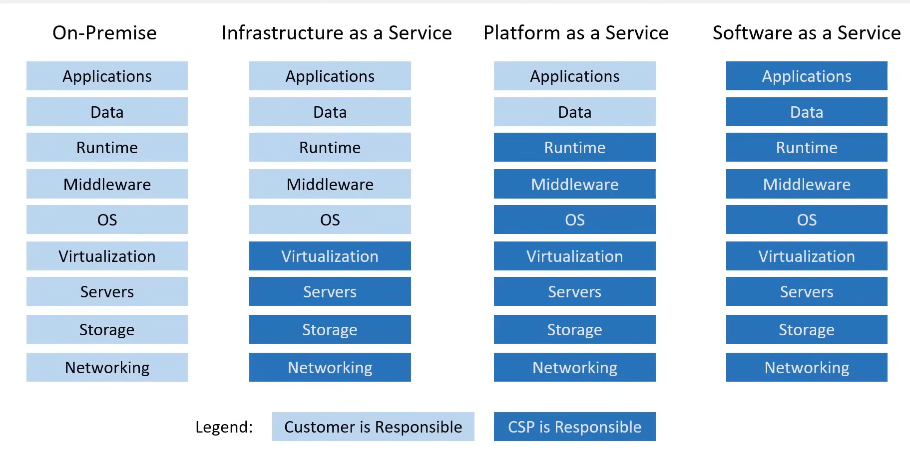
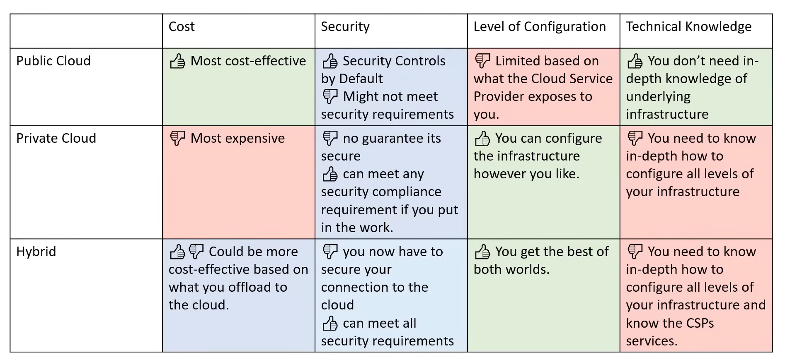
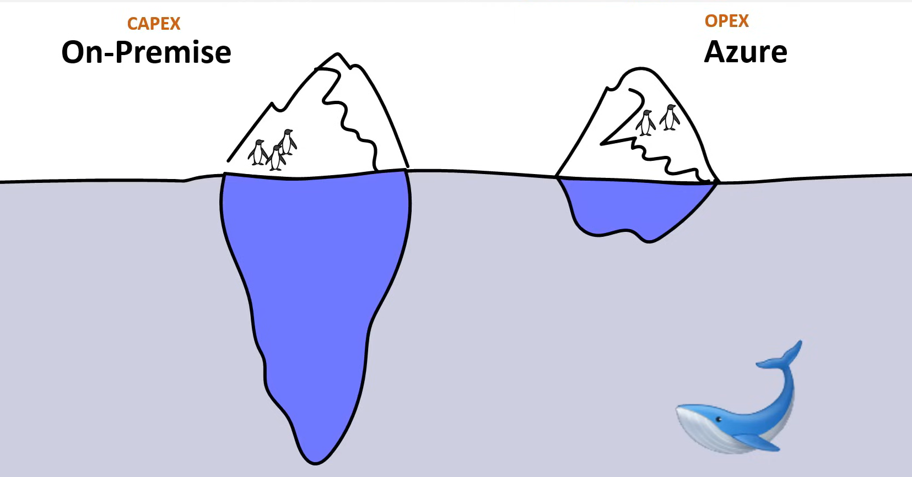
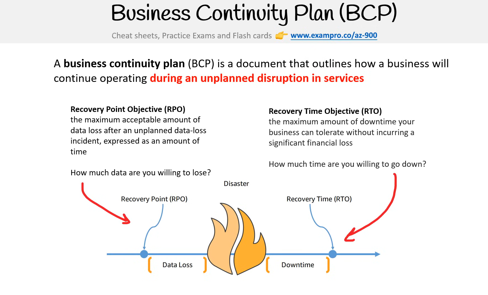
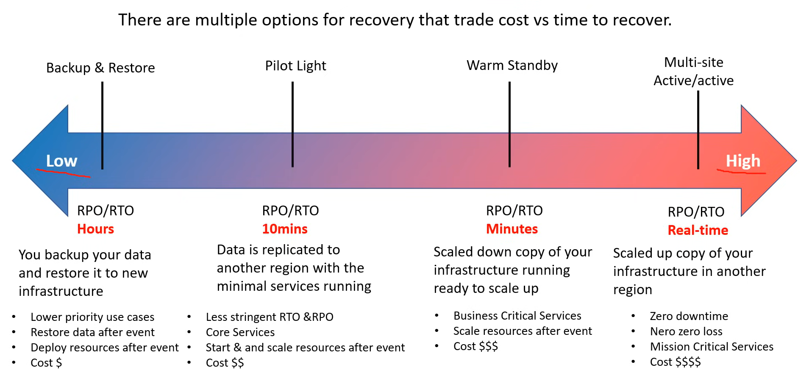

# Cloud Concepts

#### What is cloud computing?

Cloud computing is the practice of using a network of remote servers hosted on
the internet to store, manage and process data, rather than a local server or a
personal computer

##### The evolution of Cloud Hosting

In the initial days if you wanted to host a web site or a web app you would need.

**Dedicated Server** -> One physical machine dedicated to single business.
*This is very expensive, High Maintenance, High Security*

**Virtual Private Server (VPS)**.
-> One Physical machine dedicated to a single business. The physical machine is
virtualized into sub machines. Runs Multiple web apps/sites.
*Better Utilization and Isolation of Resources*

**Shared Hosting**
-> One physical, shared by hundreds of businesses. Relies on most tenants
under-utilizing their resources
*Very cheap, Limited functionality, Poor isolation*

**Cloud Hosting**
-> Multiple physical machines that act as one system. The system is abstracted
into multiple cloud services.
*Flexible Scalable, Secure, Cost Effective, High configurability*

#### Common Cloud Services

A Cloud provider can have hundreds of cloud services that are grouped various
types of services.
The four most common types of cloud services for infrastructure as a Service (IaaS)
would be:

1. Compute
2. Storage
3. Networking
4. Databases

When we say cloud computing it can be used to refer all the above it's not just
the compute part even though it has compute in the name it can mean all of these

#### Benefits of cloud computing

1. Cost Effective -> you pay as you go, no up front cost.
2. Global -> Launch workloads anywhere in the world. Just choose a region.
3. Secure -> Cloud providers take care of physical security. Cloud services can
be secure by default or you have the ability to configure access down to granular
level
4. Reliable -> data backup, disaster recovery and data replication and fault tolerance
5. Scalable -> Increase or decrease resources and services based on demand
6. Elastic -> Automatic Scaling during spikes and drop in demand
7. Up to date -> the underlying hardware and managed software is patched, upgraded,
and replaced by the cloud provider without interruption to you.

#### Types of cloud computing

1. SaaS -> Software as a service -> SalesForce, GMail, Office 365 or any other software
2. PaaS -> Platform as a service -> heroku, AWS EKS
3. IaaS -> Infrastructure as a service -> Azure, aws, Oracle.

##### Cloud computing responsibilities

##### Azure Deployment models

##### Total Cost of Ownership

This is the breakdown of each one
For on premise

- Implementation
- Configuration
- Training
- Physical Security
- Hardware
- IT Personal
- Maintenance

For Azure

- Implementation
- Configuration
- Training
-

##### Capital Expenditure (CAPEX)

Spending money upfront on physical infrastructure. DDeducting from your tax bill
over time.

- Server cost (computers)
- Storage cost (hard drives)
- Network costs (Routers, cables, switches)
- Backup and Archive cost
- Disaster Recovery cost
- Datacenter cost ( Rent cooling, pysical security)
- Technical personal

With Capital expense you have to guess upfront what you plan to spend

##### Operational Expenditure (OPEX)

The cost associated with an on-premise datacenter that gas shifted the cost to
the service provider.
The customer only has to be concerned with non physical costs.

- Leasing Software and Customizing features
- Training Employees in Cloud Services
- Paying for the cloud Support
- Billing based on cloud metrics eg
  - compute usage
  - storage usage

With Operation Expenditure you can try a product or d=service without investing
in equipment

#### High Elasticity

Your ability to automatically increase or decrease your capacity based on the current demand of traffic, memory and computing power

> Horizontal Scaling
  - Scaling Out -> Add more servers of the same size
  - Scaling in -> Removing more servers of the same size

  Vertical scaling is generally hard for traditional architecture so you will usually only see horizontal scaling described with elasticity

How do you achieve this in Azure?
We use Azure VM Scale Set -> it automatically increases or decreases in response to demand or a defined schedule.

#### Fault tolerance

your ability for your service to ensure there is no single point of failure. Preventing chances of failure.

Fail-Overs is when you have a plan to shift traffic to a redundant system in case the primary system fails.

A common example is having a copy of your database (secondary) where all ongoing changes are synced. The secondary system is not in use util a fail over occurs and it becomes the primary database.

You can use *Azure Traffic Manager* which is a DNS based traffic balancer to fail-over from a failing primary database to a stand-by secondary database. We can also use load balancers as well.

#### Disaster recovery
Your ability to recover from a disaster and to prevent the loss of data. Solutions that rev=cover from a disaster is known as Disaster recovery (DR)

 - Do you have a backup?
 - How fast can you restore that backup?
 - Does your backup still work?
 - How do you ensure current live data is not corrupt?

